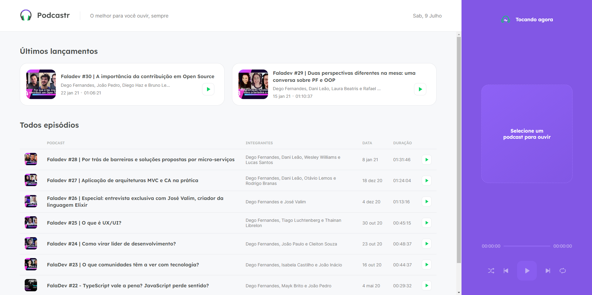

# 🎧 Podcastr

> O projeto desenvolvido na quinta edição da NLW é o Podcastr, uma plataforma cujo objetivo é escutar podcasts.

[Aplicação no ar](https://nlw-05-gm2o3y6u6-lineavelino.vercel.app/)

## **🖼️ Layout**

- É possível acessar o layout feito pela Rocketseat [clicando nesse link pro Figma](https://www.figma.com/file/cQtKXApFKUMFR0pOOSpVOb).



## ✅ To Do List

- [x] Ver últimos lançamentos
- [x] Ver lista de todos os episódios
- [x] Ler informações do episódio
- [x] Dar play / pause
- [x] Avançar / voltar
- [x] Ativar modo aleatório
- [x] Ativar repetição

## 🚀 Tecnologias utilizadas

- ReactJS
- Next
- TypeScript
- Axios
- SASS
- Date-fns
- Rc-slider
- Json-server

## 💻 Como rodar

1. Clonar o repositório:

```bash
git clone git@github.com:lineavelino/Nlw05.git
```

2. Entrar na pasta do projeto:

```bash
cd Nlw05
```

3. Abrir no editor (manualmente ou pela linha de código, como no exemplo):

```bash
code .
```

4. Instalar dependências:

```bash
yarn
```

5. Rodar o servidor fake:

```bash
yarn server
```

6. Rodar o front

```bash
yarn dev
```
